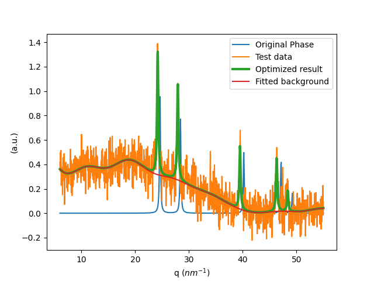

# A python wrapper of [CrystalShift.jl](https://github.com/MingChiangChang/CrystalShift.jl)
Currently only support Linux and Macs. Window installation is under testing.
## Installation (tested for Linux and Macs)
1. Install Julia
Add julia to path by adding this line in `~/.bashrc` (for linux/mac)
```console
export PATH="$PATH:path/to/julia/folder/bin"
```
where `path/to/julia/folder` is where you put the extracted julia folder (likely `/usr/local/bin/julia-$version/`)

2. Clone this repo by
`git clone https://github.com/MingChiangChang/pyPhaseLabel`
3. Then do (WITH YOUR PYTHON ENVIRONMENT ACTIVATED)
```console
cd pyPhaseLabel
chmod 755 install.sh
./install.sh
```
The only part that can go wrong is when installing pyJulia. This can give error when the julia is not installed at default location. In such case, edit the install.sh at line 16 to:
```
python -c 'import julia; julia.install(julia=$PATH_TO_JULIA_BINARY)'
```

## Usage
After installation, you should be able to use the package as following
```console
$ python
>>> from pyPhaseLabel import evaluate_obj, optimize_phase, create_phases
>>>
```
### Generate input files
The algorithm take a candidate phase and try to optimize it to fit a pattern by modifying its lattice parameters without changing the symmetry. The `cif_to_input_file.py` takes a list of cif file paths and generate a `sticks.csv` input file that contains the necessary information for the optimization. The `create_phases` function can take this input file and generate an array of `CrystalPhase` object.
 
Next, these are also the main functions that you would be interfacing with.
### Custom objects
- `CrystalPhase` contains the lattice information and a list of peak indices and intensities that is required to simulate the x-ray diffraction pattern. The optimization will optimize the lattice parameters under the assumption that no symmetry is broken.
- `BackgroundModel` uses the q value and a kernel function (see allowed list in [CovariaceFunctions.jl](https://github.com/SebastianAment/CovarianceFunctions.jl)) to simulate the background. EQ (exponential quadratic) is usually a good starting point. The `rank_tol` is the threshold value for the eigenvalue decomposition for approximating the kernal. The higher it is, the model is computationally cheaper.
- `Wildcard` contains location specified peaks (instead of specifying hkl) and will be optimized similarly. This object is self-regularized (same as background model), so you have to specify the std_θ that controls the regularized "norm".
- `PhaseModel` wraps an optional array of `CrystalPhase`, optional array of `Wildcard`, and a optional `BackgroundModel` into a object that can be optimized together to fit the given spectrum.
- `LazyTree` takes a list of `CrystalPhase` object, the number of allowed coexisting phases, the q vector, background length scale, a list of the input string of a phase and a boolean indicating whether to incoporate background in the optimization, and create a lazily-expand tree object that only expand upon request.

### Functions
- `create_phases` create `CrystalPhase` objects from a given input file.
- `evaluate_obj` evaluates custom objects and return the reconstructed x-ray pattern.
- `optimize_phases` takes a `PhaseModel` object, q vector, the given pattern and other parameters (see code comments) as input. It optimize the lattice parameters and the background to get an optimal result with the given error metric. If `gives_uncertatinty` flag equals `True`, the function returns a tuple {Optimized_PhaseModel, uncertainty_estimates_of_parameters}. Note that the uncertainty is based on Hessian and since background model is linear, there are no uncertatinty estimate for background parameters.
- `optimize_all` takes `PhaseModel` or `CrystalPhase`(s) and optimize its lattice parameters and peak intensities to fit the given pattern. See source code for the details of its arguments.
- `fit_amorphous` formulates the way to fit amorphous background, which is to include a `Wildcard` object and a smooth `BackgroundModel` into a `PhaseModel` object and optimize it.
- `search` take a `LazyTree` and the same set of input parameter as `optimize_phases` and do a tree search to search for the best phase. The return is a list of list which contains the optimized node at each level. Complexity is O(kn) where n is the number of potential phases and k is the number of the best node you search at each level. (see `test.py`)
- `search_k2n` is another search method for searching the lazytree. It's a more thorough search but its complexity is O(k<sup>2</sup>n)


## Example
This is the output of the `example.py`



As you can see from the figure, this code can fit the lattice distortion while fitting the background at once.

For usage of `Wildcard` and `fit_amorphous`, please refer to the `amorphous.py` script.
